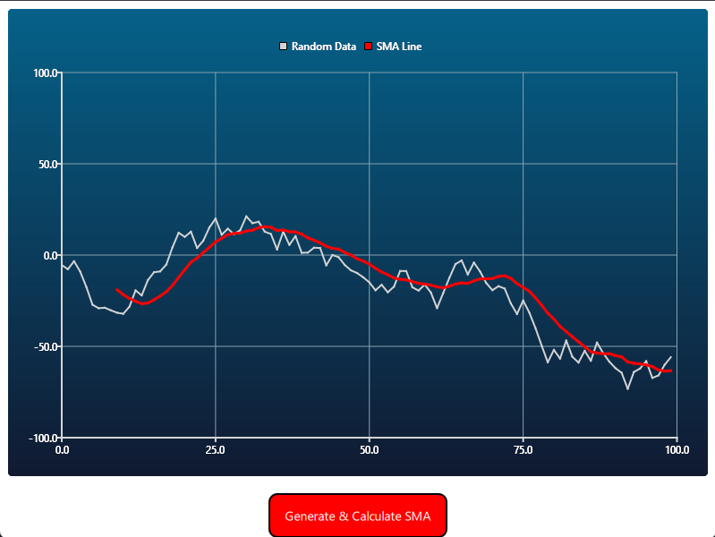

# Qt SMA Visualizer

A desktop application for generating random data and calculating the Simple Moving Average (SMA), built to demonstrate C++ and Qt skills.

--- 

## Features

- **Data Generation**: Creates a dataset of random points.
- **SMA Calculation**: Implements an optimized O(N) sliding window algorithm for SMA.
- **Visualization**: Displays both the raw data and the calculated SMA line using Qt Charts.
- **Architecture**: Follows an MVVM-like pattern with a C++ backend (`SMAgenerator`) exposed to a QML frontend.

## Tech Stack

- **Language**: C++17
- **Framework**: Qt 6
- **UI**: QML with Qt Quick Controls
- **Charting**: Qt Charts
- **Build System**: CMake

## How to Build

1.  Clone the repository: `git clone https://github.com/Pepa-21-74/Qt-SMA-Visualizer.git`
2.  Open the `CMakeLists.txt` file in Qt Creator.
3.  Select a Desktop Kit (e.g., Qt 6.x for Desktop).
4.  Build and run the project.

